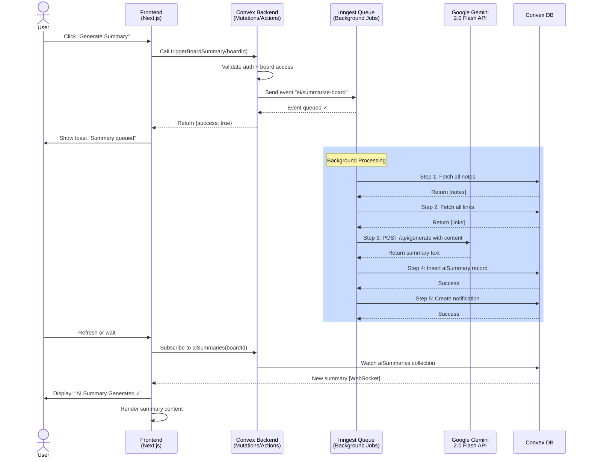
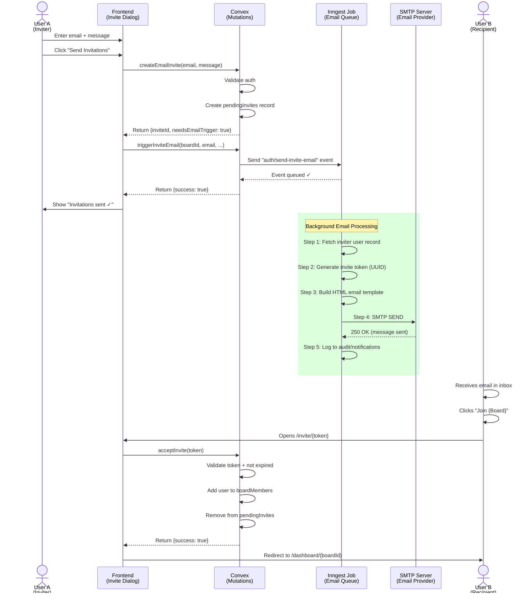
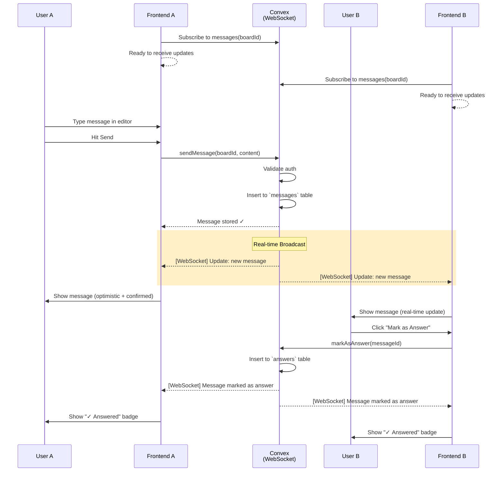
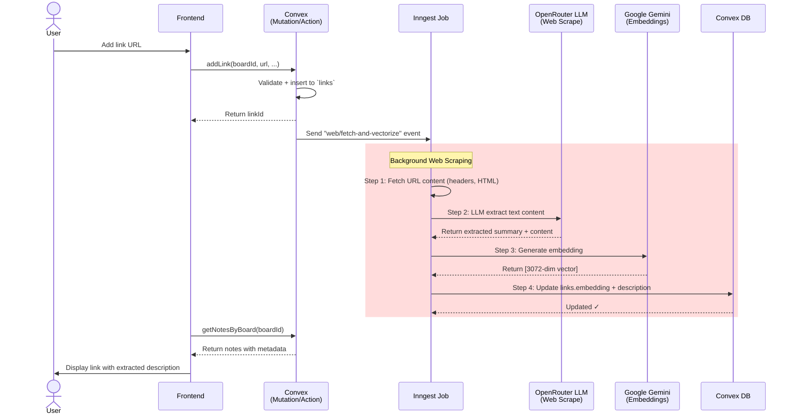

# SecondBrains Architecture

**Version**: 0.1.0  
**Last Updated**: April 12, 2026  
**Status**: Active Development

---

## 📋 Table of Contents

1. [Project Overview](#project-overview)
2. [System Architecture](#system-architecture)
3. [Technology Stack](#technology-stack)
4. [Database Schema](#database-schema)
5. [Core Flows](#core-flows)
6. [Sequence Diagrams](#sequence-diagrams)
7. [API Layer](#api-layer)
8. [Queue System (Inngest)](#queue-system-inngest)
9. [Authentication](#authentication)
10. [Deployment](#deployment)

---

## 🎯 Project Overview

**SecondBrains** is a collaborative knowledge management and AI-powered discussion platform built on a modern full-stack architecture. It enables teams to:

- **Create Collaborative Boards**: Shared workspaces for knowledge organization
- **Manage Content**: Notes, links, files, and discussions in one place
- **AI-Powered Intelligence**: Automatic summaries, vector search, and AI suggestions
- **Real-time Collaboration**: Live discussions and message threads
- **Invite & Share**: Email invitations and token-based invite links
- **Background Processing**: Async jobs for expensive operations

### Key Features

| Feature                                | Status     | Implementation              |
| -------------------------------------- | ---------- | --------------------------- |
| User Authentication                    | ✅ Complete | Better Auth + Convex        |
| Board Management                       | ✅ Complete | Convex Mutations/Queries    |
| Content Management (Notes/Links/Files) | ✅ Complete | Convex + Storage API        |
| Vector Search                          | ✅ Complete | Convex Native Vector Index  |
| AI Summaries                           | ✅ Complete | Inngest + Google Gemini 2.0 |
| Email Invitations                      | ✅ Complete | Inngest + Nodemailer SMTP   |
| Real-time Discussions                  | ✅ Complete | Convex Subscriptions        |
| Notifications                          | ✅ Complete | Convex + Push (TBD)         |
| Web Scraping                           | ✅ Complete | Inngest + OpenRouter        |

---

## 🏗️ System Architecture

### High-Level Architecture Diagram

```
┌─────────────────────────┘ Clients ├──────────────────────────┐
│                                                                 │
│  ┌──────────────────┐         ┌──────────────────────┐        │
│  │  Next.js App     │         │  Mobile/Desktop      │        │
│  │  (Frontend)      │◄───────►│  Clients (Future)    │        │
│  │  - React         │         └──────────────────────┘        │
│  │  - TypeScript    │                                           │
│  │  - Convex Client │                                           │
│  └────────┬─────────┘                                           │
│           │                                                     │
│           │ WebSocket + HTTP/REST                              │
│           ▼                                                     │
│  ┌────────────────────────────────────────────────────┐        │
│  │          Convex Backend (serverless)              │        │
│  │                                                    │        │
│  │  ┌──────────────────────────────────────────┐   │        │
│  │  │  Queries & Subscriptions (Real-time)     │   │        │
│  │  │  - getBoardDetails()                     │   │        │
│  │  │  - getMessages()                         │   │        │
│  │  │  - getNotes() / getLinks()               │   │        │
│  │  └──────────────────────────────────────────┘   │        │
│  │                                                    │        │
│  │  ┌──────────────────────────────────────────┐   │        │
│  │  │  Mutations (State Changes)               │   │        │
│  │  │  - createBoard()                         │   │        │
│  │  │  - addNote() / addLink()                 │   │        │
│  │  │  - sendMessage()                         │   │        │
│  │  │  - createEmailInvite()                   │   │        │
│  │  └──────────────────────────────────────────┘   │        │
│  │                                                    │        │
│  │  ┌──────────────────────────────────────────┐   │        │
│  │  │  Actions (Auth + Queue Triggers)         │   │        │
│  │  │  - triggerBoardSummary()                 │   │        │
│  │  │  - triggerInviteEmail()                  │   │        │
│  │  │  - triggerWebScrape()                    │   │        │
│  │  └──────────────────────────────────────────┘   │        │
│  │                                                    │        │
│  │  ┌──────────────────────────────────────────┐   │        │
│  │  │  Database (Convex Native)                │   │        │
│  │  │  - 11 Tables (see schema)                │   │        │
│  │  │  - Vector Index (3072-dim Gemma)        │   │        │
│  │  │  - Native File Storage                   │   │        │
│  │  └──────────────────────────────────────────┘   │        │
│  └────────┬───────────────────────┬──────────────────┘        │
│           │                       │                            │
│   HTTP Event API           WebSocket                           │
│ (Inngest Trigger)       Connection                             │
│           │                       │                            │
│           ▼                       ▼                            │
│  ┌──────────────────┐       ┌────────────────────┐           │
│  │  Inngest Queue   │       │  Third-Party APIs  │           │
│  │  (Background)    │       │                    │           │
│  │                  │       │ ┌────────────────┐ │           │
│  │ ┌──────────────┐ │       │ │ Google Gemini  │ │           │
│  │ │ Summarize    │ │       │ │ (AI Summaries) │ │           │
│  │ │ Board Job    │ │       │ └────────────────┘ │           │
│  │ └──────────────┘ │       │ ┌────────────────┐ │           │
│  │                  │       │ │ OpenRouter     │ │           │
│  │ ┌──────────────┐ │       │ │ (Web Scrape)   │ │           │
│  │ │ Send Email   │ │       │ └────────────────┘ │           │
│  │ │ Invite Job   │ │       │ ┌────────────────┐ │           │
│  │ └──────────────┘ │       │ │ SMTP Server    │ │           │
│  │                  │       │ │ (Email Deliver)│ │           │
│  │ ┌──────────────┐ │       │ └────────────────┘ │           │
│  │ │ Web Scrape & │ │       └────────────────────┘           │
│  │ │ Vectorize    │ │                                         │
│  │ │ Job          │ │                                         │
│  │ └──────────────┘ │                                         │
│  └──────────────────┘                                         │
│                                                                 │
└─────────────────────────────────────────────────────────────────┘
```

---

## 🛠️ Technology Stack

### Frontend
- **Framework**: Next.js 15+ (React 19)
- **Language**: TypeScript 5+
- **Styling**: Tailwind CSS + Shadcn/ui components
- **State**: Convex Client (real-time subscriptions)
- **Forms**: React Hook Form + Zod validation
- **Markdown**: React-Markdown + Syntax Highlighter

### Backend
- **Runtime**: Convex (Serverless)
- **Language**: TypeScript
- **Database**: Convex Native (Document + Vector)
- **Search**: Native Vector Index (3072 dimensions)
- **File Storage**: Convex Storage API
- **Queue System**: Inngest
- **Authentication**: Convex Auth + Better Auth

### External Services
- **AI Models**:
  - Google Gemini 2.0 Flash (summaries)
  - Gemma/OpenRouter (web scraping)
- **Email**: Nodemailer + SMTP-compatible provider (Gmail, SendGrid, etc.)
- **Web Scraping**: Cheerio + OpenRouter LLM

### Deployment
- **Frontend**: Vercel (Next.js optimized)
- **Backend**: Convex (auto-scaling serverless)
- **Queue**: Inngest (managed background jobs)
- **Database**: Convex Managed (cloud-hosted)

---

## 📊 Database Schema

### Tables Overview

```
11 Core Tables:
├── user (Users synced from Better Auth)
├── userSettings (User preferences)
├── boards (Shared workspaces)
├── boardMembers (Board membership + roles)
├── notes (Text notes with embeddings)
├── links (Saved links with descriptions)
├── fileMetas (Uploaded file metadata)
├── messages (Discussion messages)
├── answers (Marked-as-answer messages)
├── aiSummaries (Generated AI summaries)
├── pendingInvites (Email invites awaiting acceptance)
└── notifications (User notifications)
```

### Key Relationships

```
user (1) ──────────────┐
                       │
                  (N) boardMembers (N) ──────────── boards (1)
                       │                              │
                       │          ┌───────────────────┤
                       │          │                   │
                    notes ◄───────┤                   │
                    links ◄───────┤                   │
                  fileMetas ◄─────┤                   │
                   messages ◄─────┤                   │
                 aiSummaries ◄────┤                   │
              pendingInvites ◄────┤                   │
              notifications ◄─────┘                   │
                   answers ◄───────────── messages ◄───

Vector Index:
├── notes.embedding (Convex Native Vector Index)
└── links.embedding (Convex Native Vector Index)
    Used for semantic search across board content
    Dimension: 3072 (Gemma embedding size)
```

### Table Details

#### `user`
User accounts synced from Better Auth
```typescript
{
  userId: string      // Better Auth user.id
  name: string
  email: string
  emailVerified: boolean
  image?: string
  role?: string       // "admin", "user", etc.
  phone?: string
  whatsapp?: string
  telegram?: string
  totalPoints?: number
  createdAt: number
  updatedAt: number
}
```

#### `boards`
Shared workspaces for collaboration
```typescript
{
  title: string
  description: string
  ownerId: string            // User who created
  inviteToken?: string       // For public invite links
  filesData?: any            // Legacy/metadata
  linksData?: any
  notesData?: any
}
Index: by_owner, by_invite
```

#### `notes`
Text content with vector embeddings
```typescript
{
  boardId: Id<"boards">
  content: string
  authorId: string
  authorName: string
  sourceFileId?: string      // If extracted from file
  sourceFileName?: string
  embedding?: number[]       // AI-generated embedding
}
Index: by_board, by_author
Vector: by_embedding (3072-dim, filtered by boardId)
```

#### `aiSummaries`
Generated board summaries
```typescript
{
  boardId: Id<"boards">
  content: string            // Markdown formatted
  generatedBy: string        // Usually "system" or Gemini
}
Index: by_board
```

---

## 🔄 Core Flows

### 1. Board Creation Flow
```
User → "Create Board" Button
    ↓
Create Dialog (Component)
    ↓
createBoard() Mutation
    ↓
DB: Insert into `boards`
    ↓
DB: Insert into `boardMembers` (user as owner)
    ↓
Return Board to UI
    ↓
Redirect to /dashboard/{boardId}
```

### 2. Note/Content Addition Flow
```
User → Editor Component
    ↓
addNote() Mutation
    ↓
DB: Insert into `notes` {boardId, content, authorId}
    ↓
[Background] Inngest Job: Web Scraping (if URL)
    ↓
[Background] Generate Embedding (async)
    ↓
[Background] Update `notes.embedding`
    ↓
Real-time Subscription: UI updates via WebSocket
```

### 3. AI Summary Generation Flow
```
User → "Generate Summary" Button
    ↓
triggerBoardSummary() Action
    ↓
Convex validates auth
    ↓
Send event to Inngest: "ai/summarize-board"
    ↓
Inngest Job: summarizeBoardJob
    ├─ Step 1: Fetch all `notes` from board
    ├─ Step 2: Fetch all `links` from board
    ├─ Step 3: Call Google Gemini 2.0 Flash API
    ├─ Step 4: storeSummary() mutation → DB
    └─ Step 5: Create notification for board owner
    ↓
[Optional] UI polls or subscribes to aiSummaries
    ↓
Display summary in AISummaryCard component
```

### 4. Email Invitation Flow
```
User → "Invite Users" Dialog
    ↓
Enter email(s) + optional message
    ↓
createEmailInvite() Mutation
    ├─ Create record in `pendingInvites`
    └─ Return inviteId + needsEmailTrigger flag
    ↓
triggerInviteEmail() Action
    ↓
Send event to Inngest: "auth/send-invite-email"
    ↓
Inngest Job: sendInviteEmailJob
    ├─ Step 1: Fetch inviter from `user` table
    ├─ Step 2: Generate invite token
    ├─ Step 3: Build HTML email template
    ├─ Step 4: Send via Nodemailer SMTP
    │   └─ Config: SMTP_HOST, SMTP_USER, SMTP_PASS
    └─ Step 5: Log to notifications (optional)
    ↓
Recipient receives email with invite link
    ↓
Click link → acceptInvite(token) Mutation
    ↓
DB: Add user to `boardMembers`
    ↓
DB: Remove from `pendingInvites`
```

### 5. Real-time Discussion Flow
```
User A → "Send Message" in discussion
    ↓
sendMessage() Mutation
    ↓
DB: Insert into `messages` {boardId, content, authorId}
    ↓
Subscription Updates (WebSocket)
    ├─ User A sees message immediately
    └─ User B/C connected to same board also see it
    ↓
Optional: User marks as "answer"
    ↓
markAsAnswer() Mutation
    ↓
DB: Insert into `answers` {messageId, markedById}
    ↓
Real-time update: Message badge changes to "✓ Answered"
```

### 6. Vector Search Flow
```
User → Search bar (with semantic search)
    ↓
searchNotesByEmbedding() Query
    ↓
User query gets embedded (tokenized + sent to API)
    ↓
Convex Vector Index: by_embedding
    ├─ Filter: boardId = current board
    ├─ Similarity search: top-k nearest neighbors
    └─ Return: [matching notes with scores]
    ↓
Display in search results
```

---

## 📈 Sequence Diagrams

### Sequence 1: AI Summary Generation



### Sequence 2: Email Invitation



### Sequence 3: Board Collaboration (Real-time)



### Sequence 4: Web Scraping & Vectorization



---

## 🔌 API Layer

### Convex Queries (Read-only, Real-time subscriptions)

```typescript
// Boards
getBoardDetails(boardId)
getBoardsByUser()
searchBoardsByTitle(query)

// Content
getNotesByBoard(boardId)
searchNotesByEmbedding(query, boardId)  // Vector search
getLinksByBoard(boardId)
getFilesByBoard(boardId)

// Discussions
getMessagesByBoard(boardId)
getAnsweredMessages(boardId)

// Summaries
getBoardSummary(boardId)

// Notifications
getNotifications(userId)

// Invites
getBoardByInviteToken(token)
getPendingInvites(email)
```

### Convex Mutations (State-changing)

```typescript
// Boards
createBoard(title, description)
updateBoard(boardId, updates)
deleteBoard(boardId)
addBoardMember(boardId, userId, role)
removeBoardMember(boardId, userId)

// Content
addNote(boardId, content)
updateNote(noteId, content)
deleteNote(noteId)
addLink(boardId, url, title)
updateLink(linkId, updates)
deleteLink(linkId)
uploadFile(boardId, file)
deleteFile(fileId)

// Discussions
sendMessage(boardId, content)
deleteMessage(messageId)
markAsAnswer(messageId, markedById)

// Invites
createEmailInvite(boardId, email, message?)
createTokenInvite(boardId)
acceptInvite(token)

// Summaries
requestSummary(boardId)
storeSummary(boardId, content, generatedBy)
```

### Convex Actions (Auth + External Services)

```typescript
// Queue Triggers (send events to Inngest)
triggerBoardSummary(boardId)
triggerInviteEmail(boardId, email, boardTitle, inviterName, message)
triggerWebScrape(url, linkId)

// File Operations (requires signed URLs)
generateUploadUrl(format: "json")
getDownloadUrl(storageId)

// Auth (if needed)
getCurrentUser()
```

### Inngest Events & Jobs

```typescript
// Background Jobs (triggered via Actions)
Events:
  "ai/summarize-board" → summarizeBoardJob
  "auth/send-invite-email" → sendInviteEmailJob
  "web/fetch-and-vectorize" → fetchAndVectorizeWebpageJob

Job Definitions:
  summarizeBoardJob (Gemini 2.0 Flash)
  sendInviteEmailJob (Nodemailer SMTP)
  fetchAndVectorizeWebpageJob (OpenRouter LLM + Gemini Embed)
```

---

## 🔄 Queue System (Inngest)

### Job 1: Board Summary Generation

**Event**: `ai/summarize-board`  
**Triggered by**: `triggerBoardSummary()` action  
**Duration**: ~5-15 seconds

```typescript
// Input
{
  boardId: string
  userId: string
  boardTitle?: string
}

// Processing Steps
1. Fetch all notes from board (query db)
2. Fetch all links from board (query db)
3. Call Google Gemini 2.0 Flash with content
   - Context: notes + links
   - Prompt: "Analyze and summarize key themes"
   - Max tokens: 1500
4. Store summary via storeSummary() mutation
5. Create notification for board owner

// Output
{
  success: boolean
  boardId: string
  summaryLength: number
  contentItems: number (notes + links)
}

// Error Handling
- No content: "No content to summarize"
- API key missing: "Summary generation not available"
- API error: Fallback to "Unable to generate at this time"
- Each step isolated with try-catch
```

### Job 2: Send Email Invitation

**Event**: `auth/send-invite-email`  
**Triggered by**: `triggerInviteEmail()` action  
**Duration**: ~2-3 seconds

```typescript
// Input
{
  boardId: string
  email: string
  boardTitle: string
  inviterName: string
  message?: string
}

// Processing Steps
1. Fetch inviter user record from db
2. Generate invite token (UUID format)
3. Build professional HTML email template
   - Gradient header with branding
   - Custom inviter message section
   - "Join Board" CTA button
   - 7-day expiration notice
4. Send via Nodemailer SMTP
   - Provider: Gmail, SendGrid, etc.
   - Config: SMTP_HOST, SMTP_PORT, SMTP_USER, SMTP_PASS
5. Log sent to audit/notifications (optional)

// Output
{
  success: boolean
  email: string
  boardId: string
  inviteToken: string
  timestamp: number
}

// Error Handling
- SMTP not configured: "Email not configured"
- Invalid email: Caught by mutation
- Send error: Retry logic (Inngest built-in)
```

### Job 3: Web Scrape & Vectorize

**Event**: `web/fetch-and-vectorize`  
**Triggered by**: When link is added (future implementation)  
**Duration**: ~10-30 seconds

```typescript
// Input
{
  linkId: string
  url: string
  boardId: string
}

// Processing Steps
1. Fetch URL content (HTTP GET, headers check)
2. Extract text via cheerio or LLM
3. Call OpenRouter LLM (optimized for speed)
   - Instruction: "Extract main content + keywords"
   - Return: markdown formatted content
4. Generate embedding via Google Gemini API
   - Model: embedding-001 or similar
   - Dimension: 3072 (Gemma size)
5. Update links table: embedding + description

// Output
{
  success: boolean
  linkId: string
  contentLength: number
  hasEmbedding: boolean
}

// Error Handling
- URL fetch error: Log + continue
- LLM error: Use cheerio fallback
- Embedding error: Still store content
```

---

## 🔐 Authentication

### Flow: Better Auth + Convex

```
┌─────────────────────────────────────────────────────┐
│              Better Auth (External)                 │
│  - Handles: signin, signup, session, verification  │
│  - Manages: user accounts, accounts, sessions      │
│  - Returns: userId, email, verified status         │
└────────────────────┬────────────────────────────────┘
                     │
                     │ userId
                     ▼
┌─────────────────────────────────────────────────────┐
│        Convex Auth Context                          │
│  - ctx.auth.getUserIdentity()                       │
│  - Returns: identity.subject (userId)               │
│  - Used in: Every query/mutation for auth check     │
└────────────────────┬────────────────────────────────┘
                     │
                     │ Sync to Convex user table
                     ▼
┌─────────────────────────────────────────────────────┐
│          Convex `user` Table                        │
│  - Synced copy of Better Auth user                  │
│  - Extends fields: role, phone, totalPoints         │
│  - Used for: App-specific user data                 │
└─────────────────────────────────────────────────────┘
```

### Auth Levels

1. **Middleware** (Next.js): Protects routes (redirects to /auth/signin)
2. **Page Component**: Gets current user session
3. **Mutation Handler**: Validates identity + permissions

```typescript
// Example: Protect board creation
export const createBoard = mutation({
  handler: async (ctx, { title }) => {
    const identity = await ctx.auth.getUserIdentity();
    if (!identity) throw new Error("Unauthorized");
    
    const userId = identity.subject;
    // Now safely create board
    return ctx.db.insert("boards", {
      ownerId: userId,
      title,
      ...
    });
  }
});
```

---

## 🚀 Deployment

### Environments

| Environment | Frontend       | Backend          | Queue         |
| ----------- | -------------- | ---------------- | ------------- |
| Local Dev   | `npm run dev`  | `npx convex dev` | Inngest local |
| Staging     | Vercel Preview | Convex Staging   | Inngest Dev   |
| Production  | Vercel Prod    | Convex Prod      | Inngest Prod  |

### Deployment Steps

1. **Frontend**: Push to `main` → Vercel auto-deploys
2. **Backend**: Convex schema changes → `npx convex deploy`
3. **Functions**: Inngest auto-syncs on Next.js deploy

### Environment Variables

**.env.local** (Development)
```bash
# Convex
NEXT_PUBLIC_CONVEX_URL=http://localhost:3000

# Authentication
AUTH_SECRET=your_secret_key

# AI & Scraping
GEMINI_API_KEY=your_gemini_key
OPENROUTER_API_KEY=your_openrouter_key

# Email
SMTP_HOST=smtp.gmail.com
SMTP_PORT=587
SMTP_USER=your_email@gmail.com
SMTP_PASS=your_app_password
SMTP_FROM=noreply@secondbrains.app

# URLs
NEXT_PUBLIC_SITE_URL=http://localhost:3000
```

**.env.production** (Production)
```bash
# Convex
NEXT_PUBLIC_CONVEX_URL=https://your-deployment.convex.cloud

# Same as above but prod values
```

### Performance Targets

| Metric        | Target  | Current |
| ------------- | ------- | ------- |
| Page Load     | < 2s    | -       |
| API Response  | < 200ms | -       |
| Summary Gen   | < 15s   | ✓       |
| Email Send    | < 3s    | ✓       |
| Vector Search | < 500ms | -       |

---

## 🔧 Development Workflow

### Quick Start

```bash
# Install dependencies
pnpm install

# Start dev server
pnpm dev         # Frontend on :3000
npx convex dev   # Backend monitoring

# Create new board
1. Visit http://localhost:3000/dashboard
2. Click "Create Board"
3. Enter title + description
4. Done!
```

### Adding New Features

1. **Update schema** (if needed): `convex/schema.ts`
2. **Add function**: `convex/{feature}.ts`
3. **Test locally**: `npx convex dev --once`
4. **Create component**: `components/{feature}/`
5. **Wire to component**: Use `useMutation`, `useQuery`, `useAction`
6. **Deploy**: `git push` → auto-deploys

### Testing Queue Jobs Locally

```bash
# Start Inngest Dev Server
npx inngest-cli dev

# Trigger event from action
const result = await triggerBoardSummary({boardId});

# Watch Inngest UI: http://localhost:8288
# See job execution, retries, errors
```

---

## 📊 Project Statistics

- **Total Functions**: 23 (Convex queries, mutations, actions)
- **Inngest Jobs**: 3
- **Database Tables**: 11
- **Vector Dimensions**: 3072 (Gemma embedding size)
- **Components**: 40+
- **Lines of Code**: ~8000+

---

## 🎯 Planned Features & Implementation Roadmap

### Phase 1: Security & Access Control (Critical)

#### 1. Two-Factor Authentication (2FA)
**Status**: 🔄 In Development  
**Priority**: P0 (Critical)  
**ETA**: 2 weeks

**Implementation Plan**:
```typescript
// New table: userAuthFactors
userAuthFactors: defineTable({
  userId: string
  type: "totp" | "sms" | "email",  // TOTP = Time-based OTP
  secret?: string,                   // Base32-encoded secret for TOTP
  phoneNumber?: string,              // For SMS 2FA
  backupCodes?: string[],           // Recovery codes
  verified: boolean,
  createdAt: number,
  lastUsedAt?: number
}).index("by_user", ["userId"])

// New table: loginSessions
loginSessions: defineTable({
  userId: string
  sessionId: string,                // Unique per login attempt
  requiredFactors: string[],        // Which 2FA methods user has enabled
  completedFactors: string[],       // Already verified
  expiresAt: number,                // Session expires after 10 min
  ipAddress: string,
  userAgent: string
}).index("by_user", ["userId"])

// New mutations
verifyTotpToken(code: string)       // Verify TOTP code during login
enableTwoFactorAuth(method)         // Enable 2FA
disableTwoFactorAuth(method)        // Disable 2FA
generateBackupCodes()               // Generate recovery codes
useBackupCode(code: string)         // Use backup code for login
```

**Frontend Flow**:
```
Login Page
  ↓
Enter email + password
  ↓
API validates credentials
  ↓
Check userAuthFactors
  ├─ If 2FA enabled:
  │   ↓
  │   Show "Enter OTP" or "SMS Code" modal
  │   ↓
  │   User enters code
  │   ↓
  │   verifyTotpToken() validation
  │   ↓
  │   Session created
  └─ If 2FA disabled:
      Session created immediately
```

---

#### 2. Team Management + RBAC (Role-Based Access Control)
**Status**: 🔄 In Development  
**Priority**: P0 (Critical)  
**ETA**: 2 weeks

**New Tables**:
```typescript
// Teams (workspaces that own multiple boards)
teams: defineTable({
  name: string,
  description?: string,
  ownerId: string,                   // User who created team
  createdAt: number,
  settings: {
    allowPublicBoards: boolean,
    requireTwoFactor: boolean,        // Team-wide 2FA requirement
    dataRetentionDays?: number
  }
}).index("by_owner", ["ownerId"])

// Team members with granular roles
teamMembers: defineTable({
  teamId: v.id("teams"),
  userId: string,
  role: "owner" | "admin" | "member" | "viewer",  // Hierarchical
  permissions: string[],             // Override defaults per user
  joinedAt: number,
  invitedBy?: string
}).index("by_team", ["teamId"])
  .index("by_user", ["userId"])

// Role definitions (can be customized per team)
roles: defineTable({
  teamId: v.id("teams"),
  name: string,                      // "Editor", "Reviewer", etc.
  permissions: string[],             // ["board:read", "board:write", ...]
  isCustom: boolean
}).index("by_team", ["teamId"])
```

**Permission Matrix**:
```
┌─────────────────┬─────────┬───────┬─────────┬────────┐
│ Action          │ Owner   │ Admin │ Member  │ Viewer │
├─────────────────┼─────────┼───────┼─────────┼────────┤
│ Create Board    │ ✓       │ ✓     │ ✓       │        │
│ Edit Board      │ ✓       │ ✓     │ ✓*      │        │
│ Delete Board    │ ✓       │ ✓     │ *       │        │
│ Add Member      │ ✓       │ ✓     │ *       │        │
│ Change Role     │ ✓       │ *     │         │        │
│ View Board      │ ✓       │ ✓     │ ✓       │ ✓      │
│ Edit Content    │ ✓       │ ✓     │ ✓*      │        │
│ Delete Content  │ ✓       │ ✓     │ *       │        │
│ View Audit Log  │ ✓       │ ✓     │         │        │
└─────────────────┴─────────┴───────┴─────────┴────────┘
* = if they created it or have explicit permission
```

**New Mutations**:
```typescript
createTeam(name, description)
updateTeamRole(teamId, userId, role)
addTeamMember(teamId, email, role)
removeTeamMember(teamId, userId)
inviteTeamMember(teamId, email)
acceptTeamInvite(token)
createCustomRole(teamId, name, permissions)
```

---

#### 3. Audit Logging
**Status**: 🔄 In Development  
**Priority**: P0 (Critical)  
**ETA**: 1 week

**New Table**:
```typescript
auditLogs: defineTable({
  userId: string,
  action: string,                   // "board:created", "note:deleted", etc.
  resourceType: "board" | "note" | "link" | "user" | "team",
  resourceId: string,
  resourceName?: string,             // For human readability
  teamId?: string,                   // Which team context
  boardId?: string,
  changes?: {
    before: Record<string, any>,     // Previous state
    after: Record<string, any>       // New state
  },
  ipAddress?: string,
  userAgent?: string,
  status: "success" | "failure",
  errorMessage?: string,
  timestamp: number,
  metadata?: Record<string, any>    // Extra context
})
  .index("by_user", ["userId"])
  .index("by_resource", ["resourceType", "resourceId"])
  .index("by_timestamp", ["timestamp"])
  .index("by_team", ["teamId"])
```

**Logging Wrapper**:
```typescript
// Helper function to log all mutations
async function logAudit(ctx, {
  userId,
  action,
  resourceType,
  resourceId,
  changes,
  ipAddress,
  status = "success",
  errorMessage
}) {
  return ctx.db.insert("auditLogs", {
    userId,
    action,
    resourceType,
    resourceId,
    changes,
    ipAddress,
    status,
    errorMessage,
    timestamp: Date.now()
  });
}

// Usage in mutations:
export const deleteNote = mutation({
  async handler(ctx, { noteId }) {
    const note = await ctx.db.get(noteId);
    const result = await ctx.db.patch(noteId, { deleted: true });
    
    await logAudit(ctx, {
      userId: ctx.auth.getUserIdentity().subject,
      action: "note:deleted",
      resourceType: "note",
      resourceId: noteId,
      changes: { before: note, after: { deleted: true } },
      status: "success"
    });
    
    return result;
  }
});
```

**Audit Log Queries**:
```typescript
getAuditLogs(resourceId, limit = 50)  // View history of a resource
getUserAuditLog(userId, limit = 50)   // All actions by a user
getTeamAuditLog(teamId, limit = 100)  // Team-wide audit trail
searchAuditLogs(query, filters)       // Advanced search by action/time/user
```

---

### Phase 2: Developer Experience & Scale

#### 4. API Rate Limiting & Quotas
**Status**: 🔄 Planned  
**Priority**: P1  
**ETA**: 3 weeks

**Implementation**:
```typescript
// New table: apiQuotas
apiQuotas: defineTable({
  teamId: string | null,             // null = user level
  userId: string | null,
  quotaType: "requests" | "storage" | "ai_calls",
  limit: number,                     // Max per period
  period: "hourly" | "daily" | "monthly",
  current: number,                   // Current usage
  resetAt: number,                   // When quota resets
  lastUpdatedAt: number
}).index("by_team", ["teamId"])
  .index("by_user", ["userId"])

// Middleware function
async function checkRateLimit(ctx, action) {
  const identity = await ctx.auth.getUserIdentity();
  const quota = await ctx.db
    .query("apiQuotas")
    .withIndex("by_user", q => q.eq("userId", identity.subject))
    .first();
  
  if (quota && quota.current >= quota.limit) {
    throw new Error(`Rate limit exceeded. Resets at ${new Date(quota.resetAt)}`);
  }
  
  // Increment
  await ctx.db.patch(quota._id, {
    current: quota.current + 1,
    lastUpdatedAt: Date.now()
  });
}

// Limits per plan
const LIMITS = {
  free: {
    requests: { hourly: 100 },
    storage: { monthly: 1000 * 1024 * 1024 },  // 1GB
    ai_calls: { daily: 10 }
  },
  pro: {
    requests: { hourly: 10000 },
    storage: { monthly: 100 * 1024 * 1024 * 1024 },  // 100GB
    ai_calls: { daily: 1000 }
  }
};
```

**Response Headers**:
```
X-RateLimit-Limit: 100
X-RateLimit-Remaining: 42
X-RateLimit-Reset: 1681234567
X-Quota-Used: 58%
```

---

#### 5. Multi-LLM Support
**Status**: 🔄 Planned  
**Priority**: P1  
**ETA**: 2 weeks

**New Tables**:
```typescript
llmProviders: defineTable({
  name: string,                      // "OpenAI", "Claude", "Custom"
  apiKey: string,                    // Encrypted
  isActive: boolean,
  models: {
    summary: string,                 // "gpt-4" | "claude-opus" 
    embed: string,                   // "text-embedding-3"
    web_scrape: string              // "gpt-3.5-turbo"
  },
  settings: {
    temperature?: number,
    maxTokens?: number,
    timeout?: number
  }
}).index("by_active", ["isActive"])

// Team LLM preferences
teamLlmSettings: defineTable({
  teamId: v.id("teams"),
  preferredProvider: string,         // Primary LLM
  fallbackProvider?: string,         // Fallback if primary fails
  costLimit?: number,                // Monthly cost limit
  costUsed: number
}).index("by_team", ["teamId"])
```

**LLM Router**:
```typescript
async function callLLM(provider, task, params) {
  const llm = await getLLMProvider(provider);
  
  switch(provider) {
    case "openai":
      return await callOpenAI(llm.apiKey, task, params);
    case "claude":
      return await callClaude(llm.apiKey, task, params);
    case "gemini":
      return await callGemini(llm.apiKey, task, params);
    default:
      throw new Error(`Unknown LLM: ${provider}`);
  }
}

// Usage in summarize job
export const summarizeBoardJob = inngest.createFunction(
  { id: "summarize-board-v2" },
  async ({ event, step }) => {
    const { boardId, teamId } = event.data;
    
    // Get team's LLM preference
    const llmSettings = await step.run("Get LLM settings", async () => {
      return await convex.query(api.llm.getTeamLlmSettings, { teamId });
    });
    
    const summary = await step.run("Generate summary", async () => {
      return await callLLM(
        llmSettings.preferredProvider,
        "summarize",
        { content, boardId }
      );
    });
  }
);
```

**Supported Providers**:
- ✅ Google Gemini (already integrated)
- 🔄 OpenAI (gpt-4, gpt-3.5-turbo)
- 🔄 Anthropic Claude (claude-opus, claude-sonnet)
- 🔄 Mistral AI
- 🔄 Open-source (via Ollama)

---

### Phase 3: Intelligence & Insights

#### 6. Advanced RAG (Retrieval-Augmented Generation)
**Status**: 🔄 Planned  
**Priority**: P2  
**ETA**: 4 weeks

**Pipeline**:
```
User Query
    ↓
1. Semantic Search (vector DB)
    ├─ Find top-k similar notes/links
    ├─ Filter by board/recency
    └─ Score by relevance
    ↓
2. Hybrid Search (combined)
    ├─ Mix keyword + semantic results
    ├─ Re-rank by relevance
    └─ Dedup + order by score
    ↓
3. Context Augmentation
    ├─ Fetch full note/link content
    ├─ Include metadata (author, date, board)
    ├─ Add recent related items
    └─ Limit to token budget (4K tokens)
    ↓
4. LLM Generation
    ├─ System prompt: "You are SecondBrains AI assistant"
    ├─ Context: Top search results
    ├─ Query: User's question
    ├─ Stream response back
    └─ Citation: Link each claim to source
    ↓
Response with citations
    └─ "[According to {note author}]: answer text"
```

**New Tables**:
```typescript
ragChunks: defineTable({
  boardId: v.id("boards"),
  sourceId: string,                  // noteId or linkId
  sourceType: "note" | "link",
  chunkIndex: number,                // For document with 10 pages
  content: string,                   // Semantic chunk (~300 tokens)
  embedding: v.array(v.float64()),  // Vector for search
  metadata: {
    title: string,
    author: string,
    createdAt: number,
    url?: string
  }
}).vectorIndex("by_embedding", {
  vectorField: "embedding",
  dimensions: 3072,
  filterFields: ["boardId"]
})

ragSessions: defineTable({
  boardId: v.id("boards"),
  userId: string,
  query: string,
  response: string,
  sources: string[],                 // Which chunks were used
  tokensUsed: number,
  responseTime: number,              // ms
  thumbsUp?: boolean,                // User feedback
  createdAt: number
}).index("by_board", ["boardId"])
```

**New Actions**:
```typescript
queryBoardRag(boardId, query, options?)
  ├─ maxResults: 5
  ├─ resultType: "answer" | "summary" | "search"
  └─ streaming: boolean           // Return stream of chunks
```

---

#### 7. Advanced Analytics Dashboard
**Status**: 🔄 Planned  
**Priority**: P2  
**ETA**: 3 weeks

**Metrics Tracked**:
```typescript
// Real-time analytics table
boardAnalytics: defineTable({
  boardId: v.id("boards"),
  date: string,                      // YYYY-MM-DD
  // Activity metrics
  activeUsers: number,
  messagesCreated: number,
  notesCreated: number,
  linksAdded: number,
  filesUploaded: number,
  // Engagement metrics
  averageSessionDuration: number,    // minutes
  searchQueries: number,
  summariesGenerated: number,
  // Content metrics
  totalNotes: number,
  totalLinks: number,
  totalFiles: number,
  totalMessages: number,
  // Quality metrics
  answerRate: number,                // % of messages marked as answer
  engagementRate: number             // active_users / total_members
})
  .index("by_board", ["boardId"])
  .index("by_date", ["date"])
```

**Dashboard Components**:
```
┌─────────────────────────────────────────────────┐
│ Analytics Dashboard                             │
├─────────────────────────────────────────────────┤
│                                                  │
│ ┌──────────────────────────────────────────┐   │
│ │ Time Period: Last 30 days ↓  Export ↓    │   │
│ └──────────────────────────────────────────┘   │
│                                                  │
│ ┌──────────┐  ┌──────────┐  ┌──────────┐      │
│ │ Activity │  │ Trending │  │Engagement│      │
│ │          │  │          │  │          │      │
│ │345 msgs  │  │+24% msgs │  │ 78% rate │      │
│ │82 notes  │  │-5% links │  │  ↑ good !│      │
│ └──────────┘  └──────────┘  └──────────┘      │
│                                                  │
│ Messages per
 Day (30d)  │
│  /|        │
│ / |      ╱╲ │
│/  |    ╱   ╲ │
│   |  ╱       ╲│
│   |╱_________│
│                                                  │
│ Top Contributors this month                    │
│ 👤 Sarah (45 messages) ████████░              │
│ 👤 Mike  (38 messages) ███████░               │
│ 👤 Lisa  (29 messages) █████░                 │
│                                                  │
└─────────────────────────────────────────────────┘
```

---

#### 8. Push Notifications (Web + Mobile)
**Status**: 🔄 Planned  
**Priority**: P1  
**ETA**: 3 weeks

**New Tables**:
```typescript
notificationSettings: defineTable({
  userId: string,
  // Notification types
  onBoardInvite: boolean,            // Default: true
  onMessageMention: boolean,         // @user
  onAnswerMarked: boolean,           // Your message was marked answer
  onBoardUpdated: boolean,           // Someone added content
  onDailyDigest: boolean,            // Summary of activity
  digestTime: string,                // "08:00" (user timezone)
  // Delivery methods
  emailEnabled: boolean,
  pushEnabled: boolean,              // Web push
  smsEnabled?: boolean,              // Enterprise only
  // Quiet hours
  quietHoursStart?: string,          // "22:00"
  quietHoursEnd?: string,            // "08:00"
  timezone: string                   // "America/New_York"
}).index("by_user", ["userId"])

// Push subscriptions (Web Push API)
pushSubscriptions: defineTable({
  userId: string,
  endpoint: string,                  // Unique subscription URL
  p256dh: string,                    // Encryption key
  auth: string,                      // Auth token
  userAgent: string,                 // Device info
  subscribedAt: number,
  lastUsedAt: number
}).index("by_user", ["userId"])

// Notification queue
notificationQueue: defineTable({
  userId: string,
  type: string,                      // "mention", "answer", "invite"
  title: string,
  body: string,
  data: Record<string, any>,         // Click action data
  channels: ["email", "push", "sms"], // Send via these
  status: "pending" | "sent" | "failed",
  sentAt?: number,
  retryCount: number
}).index("by_user", ["userId"])
  .index("by_status", ["status"])
```

**Inngest Job**:
```typescript
export const sendNotificationJob = inngest.createFunction(
  { id: "send-notification" },
  async ({ event, step }) => {
    const {userId, type, title, body, data, channels} = event.data;
    
    // Step 1: Get user notifications settings
    const settings = await step.run("Get settings", async () => {
      return await convex.query(api.notifications.getSettings, {userId});
    });
    
    // Step 2: Check quiet hours
    const inQuietHours = await step.run("Check quiet hours", async () => {
      const now = new Date();
      const userTime = convertToUserTimezone(now, settings.timezone);
      // Check if within quiet hours
    });
    
    // Step 3: Send via enabled channels
    if (settings.emailEnabled && channels.includes("email")) {
      await step.run("Send email", async () => {
        // Send via Nodemailer
      });
    }
    
    if (settings.pushEnabled && channels.includes("push")) {
      await step.run("Send web push", async () => {
        // Get all subscriptions for user
        // Send via Web Push API
      });
    }
  }
);
```

**Frontend Integration**:
```typescript
// Request permission (one-time)
async function subscribeToPushNotifications() {
  if ('serviceWorker' in navigator && 'PushManager' in window) {
    const registration = await navigator.serviceWorker.register('/sw.js');
    const subscription = await registration.pushManager.subscribe({
      userVisibleOnly: true,
      applicationServerKey: process.env.NEXT_PUBLIC_VAPID_PUBLIC_KEY
    });
    
    // Send subscription to backend
    await savePushSubscription(subscription);
  }
}

// Handle notification clicks
self.addEventListener('push', (event) => {
  const data = event.data.json();
  event.waitUntil(
    self.registration.showNotification(data.title, {
      body: data.body,
      icon: '/logo.png',
      data: data.data,
      actions: [
        { action: 'open', title: 'Open' },
        { action: 'close', title: 'Close' }
      ]
    })
  );
});
```

---

#### 9. Offline-First Sync (Local-First Architecture)
**Status**: 🔄 Planned  
**Priority**: P3  
**ETA**: 5 weeks

**Architecture**:
```
┌─────────────────────────────────┐
│   Browser / Mobile App          │
│                                  │
│  ┌──────────────────────────┐   │
│  │ Local IndexedDB / SQLite │   │
│  │ (Full app state copy)    │   │
│  │ - All boards            │   │
│  │ - All notes              │   │
│  │ - All messages          │   │
│  │ Encrypted at rest       │   │
│  └──────────────────────────┘   │
│          ↕↕↕                     │
│  ┌──────────────────────────┐   │
│  │ Sync Engine              │   │
│  │ - Tracks local changes  │   │
│  │ - Merges remote updates │   │
│  │ - Handles conflicts     │   │
│  │ - Queue offline changes │   │
│  └──────────────────────────┘   │
│          ↕↕↕                     │
│  ┌──────────────────────────┐   │
│  │ Convex Replication       │   │
│  │ (WebSocket / HTTP)       │   │
│  └──────────────────────────┘   │
└─────────────────────────────────┘
         ↕↕↕
    Convex Cloud DB
```

**Conflict Resolution**:
- **Last-write-wins**: Simple, use for timestamps
- **Operational Transform**: For collaborative editing (complex)
- **CRDT** (Conflict-free Replicated Data Type): Complex but powerful

**Implementation**:
```typescript
// Sync log table (tracks what changed)
syncLog: defineTable({
  userId: string,
  deviceId: string,                  // Which device made change
  entity: {
    type: "note" | "message" | "link",
    id: string,
    op: "create" | "update" | "delete"
  },
  oldValue?: Record<string, any>,
  newValue: Record<string, any>,
  timestamp: number,
  synced: boolean
}).index("by_user", ["userId"])
  .index("by_device", ["deviceId"])
  .index("by_entity", ["entity.type", "entity.id"])

// Offline mutations return optimistic updates
const localNotes = useRef(new Map());

const addNote = useMutation(async (content) => {
  const optimisticNote = {
    id: `temp-${Date.now()}`,
    content,
    createdAt: Date.now(),
    synced: false
  };
  
  // Add to local store immediately
  localNotes.current.set(optimisticNote.id, optimisticNote);
  setNotes([...notes, optimisticNote]);
  
  // Try to sync when online
  setTimeout(async () => {
    if (navigator.onLine) {
      const realNote = await mutate.addNote(content);
      localNotes.current.set(realNote.id, realNote);
      // Update UI with real ID
    }
  }, 100);
});
```

---

## 📞 Support & Troubleshooting

### Common Issues & Solutions

**Q: Summary not generating?**  
A: 
1. Check `GEMINI_API_KEY` in `.env.local`
2. Verify API key is valid (visit console.cloud.google.com)
3. Check Inngest logs: `npx inngest-cli dev` → http://localhost:8288
4. Look for:
   - `ERR_API_KEY_INVALID`: Key is wrong
   - `ERR_QUOTA_EXCEEDED`: API quota used up
   - `NETWORK_ERROR`: Can't reach Gemini API
5. Try the `triggerBoardSummary` mutation with logging:
```javascript
const result = await triggerBoardSummary({boardId});
console.log("Result:", result); // Check response
```

**Q: Email not sending?**  
A:
1. Verify SMTP configuration:
```bash
SMTP_HOST=smtp.gmail.com        # or your provider
SMTP_PORT=587                   # Usually 587 (TLS) or 25
SMTP_USER=your_email@gmail.com
SMTP_PASS=your_app_password     # NOT your regular password!
```
2. For Gmail: Generate app password (not regular password)
3. Check if SMTP is blocked by firewall: `telnet smtp.gmail.com 587`
4. Look at Inngest job logs for the actual error
5. Test with a simple email service:
```javascript
const nodemailer = require('nodemailer');
const transporter = nodemailer.createTransport({
  host: process.env.SMTP_HOST,
  port: process.env.SMTP_PORT,
  secure: false,
  auth: {
    user: process.env.SMTP_USER,
    pass: process.env.SMTP_PASS
  }
});

await transporter.sendMail({
  from: process.env.SMTP_FROM,
  to: "test@example.com",
  subject: "Test",
  text: "Test message"
});
```

**Q: Vector search not working?**  
A:
1. Verify embeddings are generated:
```javascript
// In Convex function:
const note = await ctx.db.get(noteId);
console.log("Embedding exists?", !!note.embedding);
console.log("Embedding length:", note.embedding?.length); // Should be 3072
```
2. Check Inngest job executed:
   - View http://localhost:8288
   - Filter by `web/fetch-and-vectorize` events
   - Look for completions or error logs
3. If no embeddings, manually trigger:
```javascript
await triggerWebScrape({linkId, url, boardId});
// Wait 30 seconds for job
// Then check vector index
```
4. Try raw vector search:
```javascript
const results = await ctx.db
  .query("notes")
  .withIndex("by_embedding", q => q.eq("boardId", boardId))
  .collect(); // This won't search, just check if index exists
```

**Q: Real-time updates slow or not working?**  
A:
1. Check WebSocket connection:
   - Open DevTools → Network → Filter by "WS"
   - Should see `convex://...` WebSocket
   - If not, real-time won't work
2. Check browser console for errors:
   - Look for `ConvexError` messages
   - Check if subscription query is valid
3. Verify you're using `useQuery` with subscription:
```javascript
// ✓ Good - subscribes to real-time updates
const messages = useQuery(api.messages.getMessages, {boardId});

// ✗ Bad - only fetches once
useEffect(() => {
  messages.fetch({boardId}).then(setMessages);
}, []);
```
4. Check Convex function:
   - Make sure it's a `query`, not a `mutation`
   - No errors in function handler
5. Network tab → check WebSocket frames are being received
6. Close and reopen board to restart subscription

**Q: 2FA not working?**  
A:
1. Check TOTP secret:
   - Verify secret is stored in `userAuthFactors`
   - Use correct authenticator app (Google Authenticator, Authy)
2. Time sync issue:
   - Ensure phone/device time is accurate (within 30 seconds of server)
   - TOTP relies on exact time matching
3. Debug TOTP generation:
```javascript
const speakeasy = require('speakeasy');
const secret = '...'; // From userAuthFactors

const token = speakeasy.totp({
  secret: secret,
  encoding: 'base32',
  time: Math.floor(Date.now() / 1000) // Current time
});

console.log("Expected token:", token);
console.log("User entered:", userToken);
```
4. Backup codes only work once - user might have used all
5. Check rate limiting isn't blocking login attempts

**Q: Rate limits hit too early?**  
A:
1. Check your plan:
```javascript
const quota = await ctx.db
  .query("apiQuotas")
  .withIndex("by_user", q => q.eq("userId", userId))
  .first();
console.log("Limit:", quota.limit);
console.log("Period:", quota.period);
console.log("Current:", quota.current);
```
2. See when quota resets:
   ```javascript
   const resetTime = new Date(quota.resetAt);
   ```
3. To increase: Upgrade plan or contact support
4. Check for duplicate requests in frontend:
   - Network tab might show same request twice
5. Batch operations to use requests wisely

**Q: Push notifications not showing?**  
A:
1. Check browser support:
```javascript
const supported = 'serviceWorker' in navigator && 'PushManager' in window;
console.log("Push supported:", supported);
```
2. Request permission:
```javascript
const permission = await Notification.requestPermission();
console.log("Permission:", permission); // Should be "granted"
```
3. Check service worker registered:
```javascript
const registration = await navigator.serviceWorker.ready;
console.log("Service worker active:", !!registration.active);
```
4. Verify push subscription saved:
```javascript
const subscription = await registration.pushManager.getSubscription();
console.log("Subscription exists:", !!subscription);
```
5. Mobile (PWA) needs HTTPS in production
6. Check browser notification settings (might be disabled)

**Q: Audit logs growing too large?**  
A:
1. Implement audit log retention:
```typescript
// Clean up old logs (run daily via Inngest)
const thirtyDaysAgo = Date.now() - 30 * 24 * 60 * 60 * 1000;
const oldLogs = await ctx.db
  .query("auditLogs")
  .withIndex("by_timestamp", q => q.lt("timestamp", thirtyDaysAgo))
  .collect();

for (const log of oldLogs) {
  await ctx.db.delete(log._id);
}
```
2. Archive logs to external storage (S3, etc.)
3. Create summary views instead of querying raw logs
4. Index by timestamp to optimize queries

**Q: Database quota exceeded?**  
A:
1. Check what's using space:
   ```javascript
   const stats = {
     notes: await ctx.db.query("notes").collect(),
     files: await ctx.db.query("fileMetas").collect(),
     logs: await ctx.db.query("auditLogs").collect()
   };
   ```
2. Clean up old/unused data
3. Archive files to external storage
4. Upgrade plan for more storage

**Q: Orngest jobs failing repeatedly?**  
A:
1. Check job configuration:
   - Ensure `triggers` is correct
   - Event name matches what's sent
2. Check function has required env vars:
   ```typescript
   if (!process.env.GEMINI_API_KEY) {
     throw new Error("GEMINI_API_KEY not set");
   }
   ```
3. Look at retry attempts in Inngest UI
4. Add explicit error handling:
   ```typescript
   await step.run("Safe operation", async () => {
     try {
       // operation
     } catch (err) {
       console.error("Operation failed:", err);
       // Don't throw - return error status instead
       return { success: false, error: err.message };
     }
   });
   ```
5. Check event data matches expected schema
6. Check timeouts - function might be taking too long

---

## 📚 Additional Resources

- **Convex Docs**: https://docs.convex.dev
- **Inngest Docs**: https://www.inngest.com/docs
- **Next.js Docs**: https://nextjs.org/docs
- **Tailwind CSS**: https://tailwindcss.com/docs
- **Better Auth**: https://better-auth.vercel.app/docs

---

**Made with ❤️ by SecondBrains Team**  
**Last Updated**: April 12, 2026  
**Version**: 1.1.0 (Enhanced with Phase 1-3 features)
